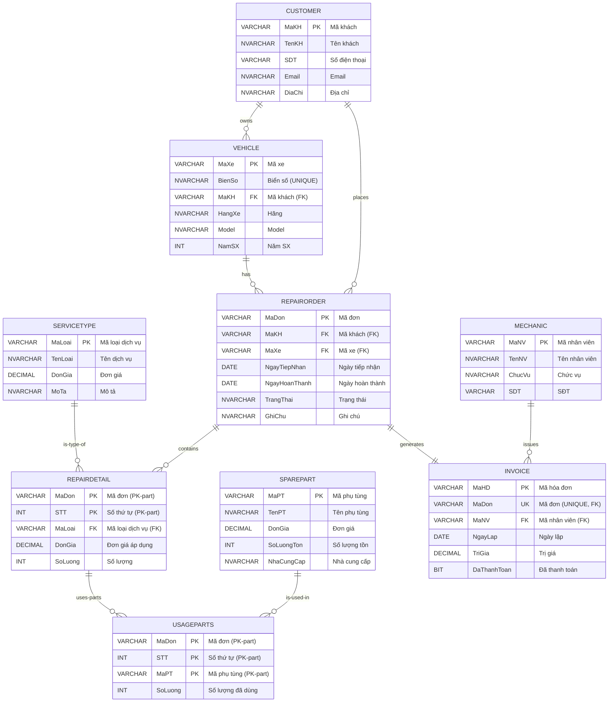

# ERD - Hệ thống quản lý gara ô tô (chi tiết thuộc tính)

```mermaid
erDiagram
    CUSTOMER {
      VARCHAR MaKH PK "Mã khách"
      NVARCHAR TenKH "Tên khách"
      VARCHAR SDT "Số điện thoại"
      NVARCHAR Email "Email"
      NVARCHAR DiaChi "Địa chỉ"
    }

    VEHICLE {
      VARCHAR MaXe PK "Mã xe"
      NVARCHAR BienSo "Biển số (UNIQUE)"
      VARCHAR MaKH FK "Mã khách (FK)"
      NVARCHAR HangXe "Hãng"
      NVARCHAR Model "Model"
      INT NamSX "Năm SX"
    }

    SERVICETYPE {
      VARCHAR MaLoai PK "Mã loại dịch vụ"
      NVARCHAR TenLoai "Tên dịch vụ"
      DECIMAL DonGia "Đơn giá"
      NVARCHAR MoTa "Mô tả"
    }

    REPAIRORDER {
      VARCHAR MaDon PK "Mã đơn"
      VARCHAR MaKH FK "Mã khách (FK)"
      VARCHAR MaXe FK "Mã xe (FK)"
      DATE NgayTiepNhan "Ngày tiếp nhận"
      DATE NgayHoanThanh "Ngày hoàn thành"
      NVARCHAR TrangThai "Trạng thái"
      NVARCHAR GhiChu "Ghi chú"
    }

    REPAIRDETAIL {
      VARCHAR MaDon PK "Mã đơn (PK-part)"
      INT STT PK "Số thứ tự (PK-part)"
      VARCHAR MaLoai FK "Mã loại dịch vụ (FK)"
      DECIMAL DonGia "Đơn giá áp dụng"
      INT SoLuong "Số lượng"
    }

    SPAREPART {
      VARCHAR MaPT PK "Mã phụ tùng"
      NVARCHAR TenPT "Tên phụ tùng"
      DECIMAL DonGia "Đơn giá"
      INT SoLuongTon "Số lượng tồn"
      NVARCHAR NhaCungCap "Nhà cung cấp"
    }

    USAGEPARTS {
      VARCHAR MaDon PK "Mã đơn (PK-part)"
      INT STT PK "Số thứ tự (PK-part)"
      VARCHAR MaPT PK "Mã phụ tùng (PK-part)"
      INT SoLuong "Số lượng đã dùng"
    }

    MECHANIC {
      VARCHAR MaNV PK "Mã nhân viên"
      NVARCHAR TenNV "Tên nhân viên"
      NVARCHAR ChucVu "Chức vụ"
      VARCHAR SDT "SĐT"
    }

    INVOICE {
      VARCHAR MaHD PK "Mã hóa đơn"
      VARCHAR MaDon UK "Mã đơn (UNIQUE, FK)"
      VARCHAR MaNV FK "Mã nhân viên (FK)"
      DATE NgayLap "Ngày lập"
      DECIMAL TriGia "Trị giá"
      BIT DaThanhToan "Đã thanh toán"
    }

    CUSTOMER ||--o{ VEHICLE : "owns"
    CUSTOMER ||--o{ REPAIRORDER : "places"
    VEHICLE ||--o{ REPAIRORDER : "has"
    REPAIRORDER ||--o{ REPAIRDETAIL : "contains"
    SERVICETYPE ||--o{ REPAIRDETAIL : "is-type-of"
    REPAIRDETAIL ||--o{ USAGEPARTS : "uses-parts"
    SPAREPART ||--o{ USAGEPARTS : "is-used-in"
    REPAIRORDER ||--|| INVOICE : "generates"
    MECHANIC ||--o{ INVOICE : "issues"
```
